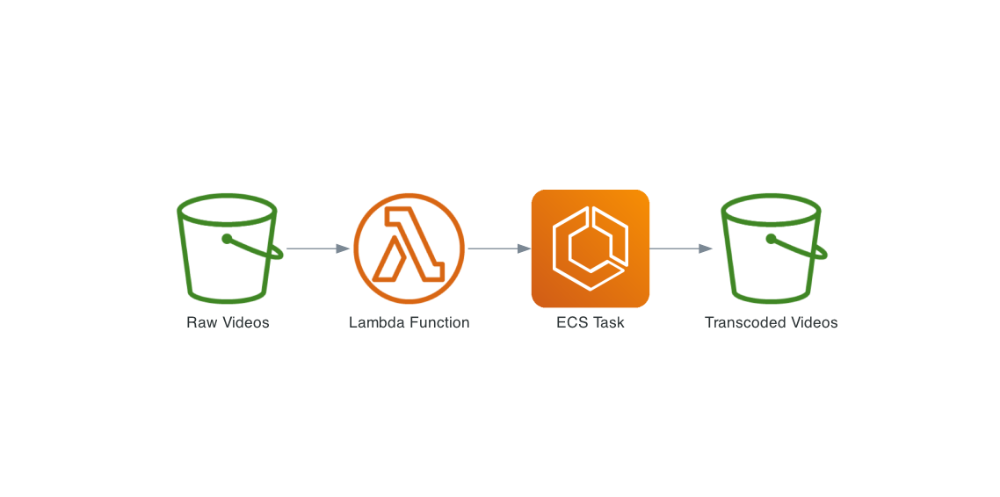

# A Serverless Video Transcoder with AWS Lambda and ECS

This is a sample project to demonstrate how to build a serverless video transcoder with AWS Lambda and ECS.

## Architecture

## How it works

1. Upload a video file to S3 bucket (e.g. `RawBucket`)
2. S3 event triggers Lambda function (e.g. `TranscoderLambda`)
3. Lambda function starts ECS task (e.g. `TranscoderTask`) with the video bucket and key as environment variable
4. ECS downloads the video from S3 bucket (e.g. `RawBucket`) and transcodes it with [ffmpeg](https://ffmpeg.org/) to different resolutions (e.g. 1080p, 720p, 480p)
5. ECS uploads the transcoded videos to different S3 bucket (e.g. `TranscodedBucket`)

## Folder structure

- `./lambda`: Lambda function source code
- `./ecs`: ECS task definition and Dockerfile
